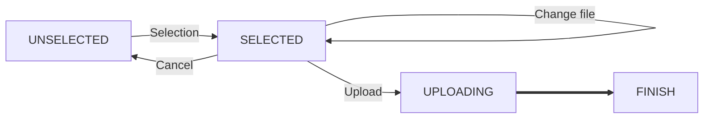

# Hallebarde-frontend

This project was bootstrapped with [Create React App](https://github.com/facebook/create-react-app).

## Available Scripts

In the project directory, you can run:

### `./configure-environment.sh local|dev`

Gets infrastructure configuration and puts it in `.env` file, which is automatically parsed by React.

Call it with `local` to get client credentials valid for `localhost`: best for testing on your computer with `npm start`. 
Call it with an environment name like `dev` before a build for uploading the website to its target domain.

This needs you to have effective AWS credentials, as it calls terragrunt to access the terraform outputs

### `npm start`

Runs the app in the development mode. 
Open [http://localhost:3000](http://localhost:3000) to view it in the browser.

The page will reload if you make edits. 
You will also see any lint errors in the console.

### `npm test`

Launches the test runner in the interactive watch mode. 
See the section about [running tests](https://facebook.github.io/create-react-app/docs/running-tests) for more information.

### `npm run build`

Builds the app for production to the `build` folder. 
It correctly bundles React in production mode and optimizes the build for the best performance.

Note that OAuth and domain configuration from the `.env` file is embedded.
The build is minified and the filenames include the hashes. 
Your app is ready to be deployed!

See the section about [deployment](https://facebook.github.io/create-react-app/docs/deployment) for more information.

## File upload flow

